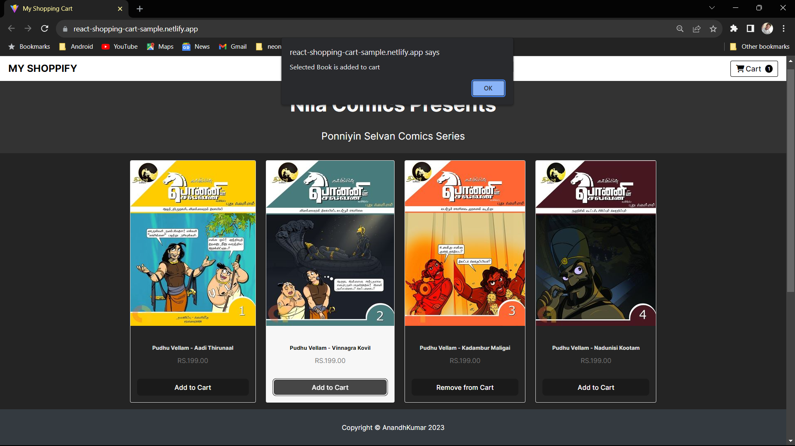

# My Shopping Cart App

Welcome to My Shopping Cart App! This is a simple React application that allows users to browse products and add them to a shopping cart.

## Getting Started

To run the application locally, follow these steps:

1. Clone this repository: `https://github.com/anandhakumarmca/react-shopping-cart-app.git`
2. Navigate to the project directory: `cd react-shopping-cart-app`
3. Install dependencies: `npm install`
4. Start the development server: `npm start`
5. Open your browser and go to: `http://localhost:3000`

## Features

- Browse a list of products with images, titles, and prices.
- Add products to the shopping cart.
- Remove products from the shopping cart.
- Responsive design for different screen sizes.

## Folder Structure

- `public/`: Contains the HTML template and public assets.
- `src/`: Contains the main source code.
  - `components/`: Contains React components.
  - `components/`: Contains CSS styles for the components.
  - `App.js`: Main application component.
  - `index.js`: Entry point for React rendering.

## Dependencies

- React
- Font Awesome (for icons)

## How to Contribute

Contributions are welcome! Here's how you can get involved:

1. Fork the repository.
2. Create a new branch: `git checkout -b feature/new-feature`
3. Make your changes and commit: `git commit -m "Add new feature"`
4. Push your changes to your forked repository: `git push origin feature/new-feature`
5. Create a pull request.

Sample Output

Live Demo
Check out the live demo of the app on Netlify: https://react-shopping-cart-sample.netlify.app/

